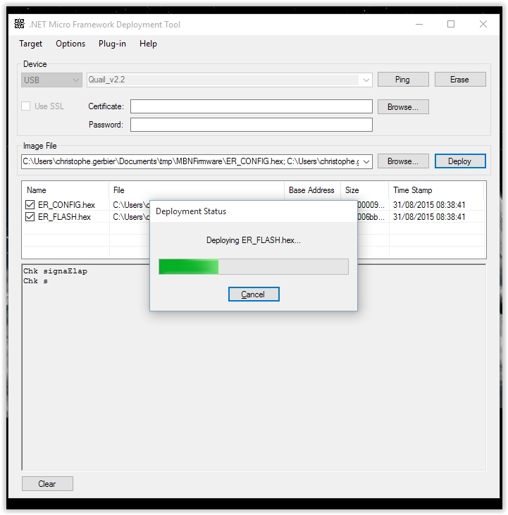

Upgrading the firmware on MBN boards is quite easy. It only requires a few simple steps :

Download the latest firmware from our Download page
Put the board into DFU mode
Load the new bootloader into memory
And finally flash the new firmware
So let’s begin the process !

First, we will put the board in DFU mode.

While the board is powered, you will enter DFU mode by pressing both the “Boot” and “Reset” buttons and then releasing the “Reset” button.
Those are the buttons labelled 15 & 16 : 

If you do not already have it installed, you will need the ST Microelectronics’s DFuSe program. It is available at the bottom [of this page](http://www.st.com/web/en/catalog/tools/FM147/CL1794/SC961/SS1533/PF257916?s_searchtype=keyword#).

Now launch the ST Dfu Demo program you have just installed before. If the board is in DFU mode, it should display something similar to this picture.

If this is not the case, then you simply have to repeat the process with the two buttons (15 & 16) seen just above.

Now click on the “Choose” button on the bottom and navigate to the place where you have unzipped the firmware files.

You will then select the file named Quail.dfu.

You will then get a warning message that you can safely ignore.

Then the process of the upgrade will begin. It will not last very long 🙂

You can now leave the DFU mode by clicking the “Leave DFU mode” button in the upper left region.

You are done with the bootloader.

Now we will update the firmware.

To do this, run the MFDeploy utility, found in C:\Program Files (x86)\Microsoft .NET Micro Framework\v4.3\Tools if you did not change the default installation of NETMF.

Select USB transport and the Quail mainboard should appear in the list.

Then, click the “Browse” button and locate the files ER_CONFIG.hex and ER_FLASH.hex. They should be at the same location than the bootloader .dfu file seen before.

Select both files and click “Open”.

You will now start the deployment of the new firmware by clicking on the “Deploy” button.

The program will connect to the Quail board…

… and start erasing the firmware region.

This can take a few seconds before it starts.

Once the firmware region has been erased, MFDeploy will start loading the new firmware.

This steps takes only a few seconds and once the deployment status window has gone, then the firmware has been updated !

You can then leave MFDeploy and go to Visual Studio to code your application with the newest features 🙂

That’s all, folks !