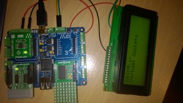

# **Virtual Sockets**
One of MikroBUS.NET great features is what we proudly call Virtual Sockets. In this document, we will tell you what it can do for you and how to use it with you Quail board.

Maybe I should start at the end, though… Because how to use it will not be long ! But the list of what it can do for you will be (much) longer. Here is a simple code sample :

```csharp
var _vsocket = Hardware.Socket3;
_vsocket.Int = Hardware.Socket3.An;

var eth = new EthClick(_vsocket);
```

That’s all 🙂

As you can see, it is pretty simple. And I can assure you that every example we will see in this article will be as simple as this one.
So you may wonder how such a simple thing can be powerful or even useful. I will tell you that just after introducing the concept of sockets that we use on the Quail board.

On the Quail board, we are using 4 MikroBUS sockets. Each pin on a socket has a pre-defined function : PWM, INT, SPI and so on. Each Click board built by MikroElektronika is using this pre-defined assignment.
But pre-defined does not mean “fixed” and the pin labeled “INT” (for example) can be assigned to a standard OutputPort or an InputPort. The fact that the assignment is pre-defined, though, allows us to plug a Click board on any socket, without any restriction. It can even allow two or more Click boards to be stacked, if they do not use the same pins (see the Relay Click driver demo video for an example).

Our drivers (available on the Download page of the website) are all using a Hardware.Socket in their constructor. You simply have to pass the socket you have plugged the board in to the constructor.

This gives code like this one :

```csharp
public class Program
    {
        static ThunderClick _thunder;	// Module based on the AS3935 chip

        public static void Main()
        {
            // Create the instance with the ThunderClick board on Socket1 of the Quail board
            _thunder = new ThunderClick(Hardware.SocketOne);
```

Since the drivers are 100% pure NETMF, they are easily reusable for non Click boards. But then you might ask : how can I wire it to the Quail and which socket will I pass to the constructor ?

This is where Virtual Sockets come in handy !

Now it time to take a real example with a Quail and a Devantech LCD03 in I2C mode. The Quail board exposes I2C on each socket, of course, but on screw terminals as well (along with 3.3V, 5V and ground).
So we will use the screw terminals to wire the LCD : power to 3.3V & GND and I2C to… SCL/SDA 🙂


 Once it is wired, you can open Visual Studio and create a new MBN application project. This is not really mandatory and a NETMF project would work, but the MBN template is referencing the MBN core and prepares a nice source for you.
Next, you will have to download the LCD03 driver from our site and add the source code to your project (\*). In the generated program.cs, replace BarGraphClick with DevantechLcd03.

You should then have something like this :

```csharp
public class Program
using MBN;
using System.Threading;
using MBN.Modules;

namespace Examples
{
    public class Program
    {
        private static DevantechLcd03_lcd;

        public static void Main()
        {
            _lcd = new DevantechLcd03(......);

            Thread.Sleep(Timeout.Infinite);
        }
    }
}
```

The LCD03 driver then needs a socket and the I2C address of the module. But… it is not wired to a socket but to screw terminals !

No problem, just create a Virtual Socket with the needed information :

```csharp
public class Program
namespace Examples
{
    public class Program
    {
        private static DevantechLcd03 _lcd;

        public static void Main()
        {
			var virtualSocket = new Hardware.Socket
							{
								Scl = Hardware.SocketOne.Scl,
								Sda = Hardware.SocketOne.Sda
							};
            _lcd = new DevantechLcd03(virtualSocket, 0xC8 >> 1);

            Thread.Sleep(Timeout.Infinite);
        }
    }
}
```

What did we do ?

First, we create the socket instance, with the “new” keyword, then we assign I2C pins to this socket. Here, we are using I2C, which is a bus. So, every socket on the Quail board is connected to the same bus, hence the same pins.
This is why we have used the I2C pins assigned to SocketOne. We could have used SocketTwo as well. And you do not even need to know what are the underlying processor pins !

And we are done !

We can now enhance this program so that it is displaying something :

```csharp
public class Program
			var virtualSocket = new Hardware.Socket
				{
					Scl = Hardware.SocketOne.Scl,
					Sda = Hardware.SocketOne.Sda
				};
				_lcd = new DevantechLcd03(virtualSocket, 0xC8 >> 1)
				{
					BackLight = true, 
					Cursor = DevantechLcd03.Cursors.Hide
				};
				_lcd.ClearScreen();
				_lcd.Write(1,1,"Using...");
				_lcd.Write(1,2,"Virtual Sockets");
```



As you can see, this is very simple.

Now, let’s imagine that this LCD has a on/off feature for the backlight that you can wire externally (this is not the case of the Devantech LCD03). We will wire it on a pin exposed on the screw terminals : PE5
We decide to connect it to the Rst pin in the socket. We could have chosen the INT pin as well, or any other non-bus pin.

```csharp
public class Program				
				var virtualSocket = new Hardware.Socket
				{
					Scl = Hardware.SocketOne.Scl,
					Sda = Hardware.SocketOne.Sda,
					Rst = Pin.PE5
				};
				_lcd = new DevantechLcd03(virtualSocket, 0xC8 >> 1)
				var _lcdONOFF = new OutputPort(virtualSocket.Rst, false);
``` 
Now, let’s take another example that will be using Quail and the GHI Gadgeteer ENC28J network module.
We already have a driver for this module as it is using the same chip as MikroElektronika ETH Click board. So software is not a problem.
But wait ! The GHI module is not a Click module !? We have the solution with one of our G-Adapters, the one labeled Type-S (for SPI). Those adapters permit the use of Gadgeteer modules on the Quail board in a very easy way.

The hardware will then look like this, with the G-Adapter on socket 3 on Quail :


But on the backside on the G-Adapter, we can see that the Gadgeteer pin 5 (INT pin of the ENC28) is not connected to the MikroBUS INT pin but to the AN pin 🙁


Virtual Socket will solve that problem in less time than it takes to write this blog post 🙂 Remember, we have plugged the G-Adapter on socket 3. This will then give :

```csharp
public class Program
			var virtualSocket = Hardware.Socket3;
			virtualSocket.Int = Hardware.Socket3.An;

			var _eth = new EthClick (virtualSocket);
			
			_eth.Start(_eth.GenerateUniqueMacAddress("MikroBusNet"), "MikroBusNet");

			while (true)
			{
				if (_eth.ConnectedToInternet)
				{
					Debug.Print("Connected to Internet");
					break;
				}
				Debug.Print("Waiting on Internet connection");
			}
```
As you can see, there is not need for hardware “green wire” or driver’s modification.

Finally, here are two examples, with more pins used and with the modules on a breadboard wired to the screw terminals of the Quail.

This first example is using GHi’s Character display, which is a Serial LCD :

```csharp
public class Program
	  private static CharacterDisplay lcd;

      public static void Main()
      {
         var virtualSocket = new Hardware.Socket
         {
            An = Pin.PC5,
            Rst = Pin.PB0,
            Cs = Pin.PE7,
            Pwm = Pin.PE8,
            Int = Pin.PE11,
            Rx = Pin.PC4,
            Tx = Pin.PE13,
            Name = "VirtualCharacterDisplaySocket"		// You can even give a name to the Virtual Socket ;)
         };

         lcd = new CharacterDisplay(virtualSocket);

         lcd.Clear();
         lcd.SetBacklight(true);
         lcd.PrintString("Hello");
      }
```

You can see a demo video of such a character display connected to our Dalmatian board (2 MikroBUS sockets) via a G-Adapter type XY. The video is demonstrating the GPS3 Click driver : https://youtu.be/cOV6Dt12NwU

The last example is using MikroElektronika UV Click, which is a SPI module.

```csharp
public class Program
private static UVClick uv;

      public static void Main()
      {
         var virtualSocket = new Hardware.Socket
         {
            An = Pin.PC5, // Connected to Pin PC5 on exposed screw terminal
            Rst = Pin.PB0, // Connected to Pin PB0 on exposed screw terminal
            Miso = Hardware.Socket3.Miso,
            Mosi = Hardware.Socket3.Mosi,
            Cs = Pin.PC7, // Connected to Pin PC7 on exposed screw terminal
            Sck = Hardware.Socket3.Sck,
            SpiModule = Hardware.Socket3.SpiModule
         };

         uv = new UVClick(virtualSocket);

         while (true)
         {
            Debug.Print("UV - " + uv.ReadUVIntensity());
            Thread.Sleep(2000);
         }
      }
```

On the Quail board, the screw terminals expose SPI3, like sockets 3 & 4. Hence the use of the SocketThree pins definition. We do not have to know what the underlying real pins are (PC11, PC12, PC10 respectively if you really want to know 🙂 )

If you wanted to put the real pins, it would look like this :

```csharp
public class Program	  
	public static void Main()
      {
         var virtualSocket = new Hardware.Socket
         {
            An = Pin.PC5, // Connected to Pin PC5 on exposed screw terminal
            Rst = Pin.PB0, // Connected to Pin PB0 on exposed screw terminal
            Miso = Pin.PC11,
            Mosi = Pin.PC12
            Cs = Pin.PC7, // Connected to Pin PC7 on exposed screw terminal
            Sck = PinPC10,
            SpiModule = SPI.SPI_module.SPI3
         };

         uv = new UVClick(virtualSocket);

         while (true)
         {
            Debug.Print("UV - " + uv.ReadUVIntensity());
            Thread.Sleep(2000);
         }
      }
``` 

Now we are at the end of this topic. I hope you are not sleeping 🙂 And that you better understand the power of Virtual Sockets.

To summarize, I would say that : if you have the MBN driver for your module, then no matter if it is Gadgeteer, custom module or MikroE Click board, you will be able to easily use it on a MBN board ! Dalmatian, Tuatara and Quail are all able to use this nice feature.

 

Thank you for reading.

 

(\*) We do not deliver complete compiled DLLs with full of useless stuff. We provide each driver’s source code so that you include only what you need.